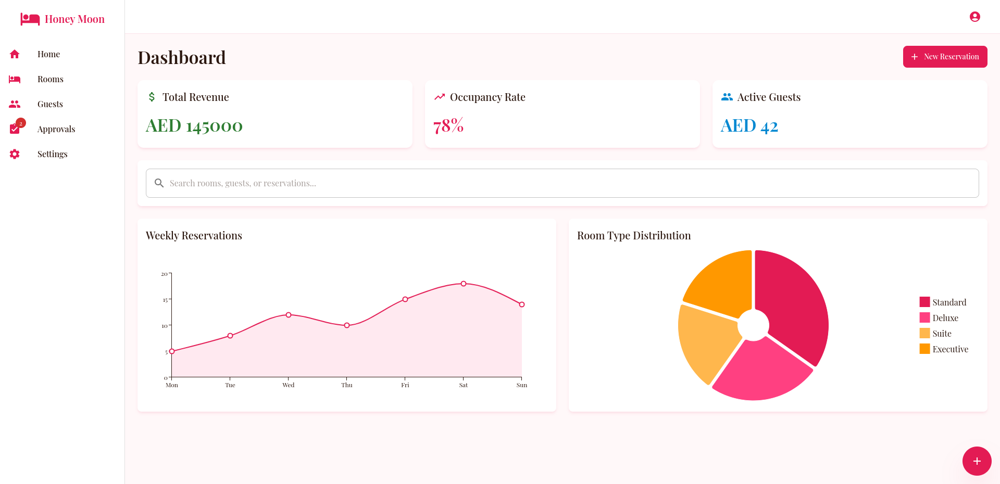
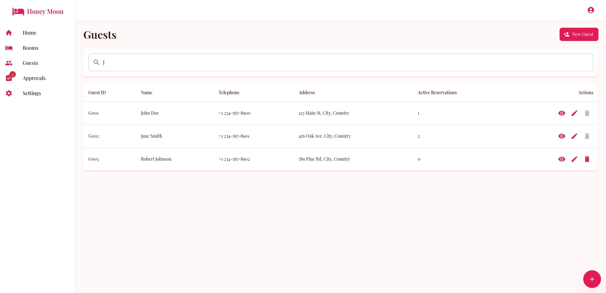
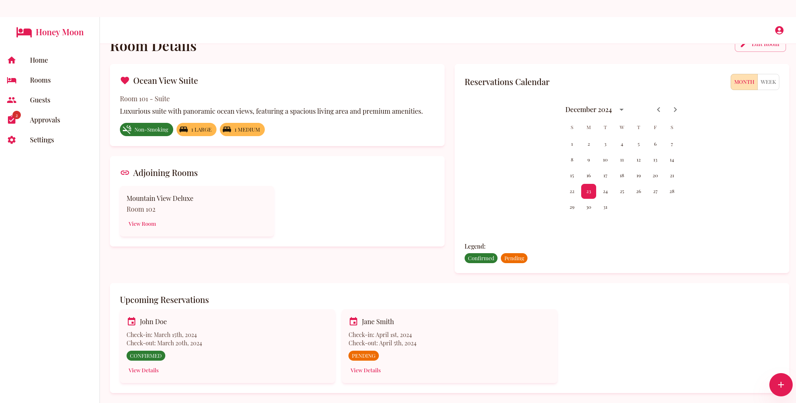

# Honey Moon Hotel

This is a demo site (static) for a hotel reservation system, made as part of a project for a course. 
It is a front desk system for a hotel, where the only two actors involved are the clerk and the manager.

[Try it <svg xmlns="http://www.w3.org/2000/svg" height="20px" viewBox="0 -960 960 960" width="20px" fill="#e8eaed"><path d="M216-144q-29.7 0-50.85-21.15Q144-186.3 144-216v-528q0-29.7 21.15-50.85Q186.3-816 216-816h264v72H216v528h528v-264h72v264q0 29.7-21.15 50.85Q773.7-144 744-144H216Zm171-192-51-51 357-357H576v-72h240v240h-72v-117L387-336Z"/></svg>](https://honey-moon-hotel.pages.dev/)

- Manager
  - username: manager1
  - password: 1234
- Clerk
  - username: clerk1
  - password: 1234

It was created **with HELP of AI** within just about **3 hours!** (Disregarding the time spent drawing out the requirements and specifications and deciding on the basic structure of the website.) There was ZERO actual coding. This shows how AI can ease the development process for ("and may be even someday replacing 😊") US.

The specific AI tool used was [bolt.new <svg xmlns="http://www.w3.org/2000/svg" height="20px" viewBox="0 -960 960 960" width="20px" fill="#e8eaed"><path d="M216-144q-29.7 0-50.85-21.15Q144-186.3 144-216v-528q0-29.7 21.15-50.85Q186.3-816 216-816h264v72H216v528h528v-264h72v264q0 29.7-21.15 50.85Q773.7-144 744-144H216Zm171-192-51-51 357-357H576v-72h240v240h-72v-117L387-336Z"/></svg>](https://bolt.new/). The tool lets you create website just by chatting with it the specifications, uploading files if needed and of course the option to manually edit the generated files. It utilized mobile-first approach, creates responsive sites and handles theming based on some give image or context. But be warned it still has its GOTCHAs.

You can find the initial PROMPT supplied to the tool [here](doc/inital-prompt.txt) (half of it is UML Class specification). It took quite amount of tweaking afterward.

Snapshots:

